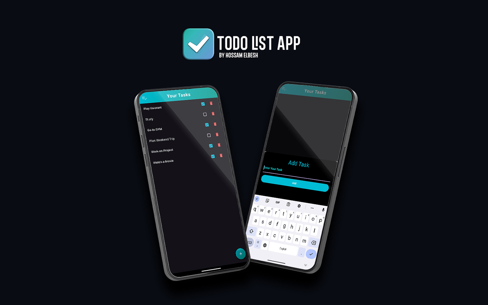

# To-Do List App

A simple and elegant to-do list application built with Flutter. This app allows users to manage their tasks efficiently, providing features to add, check off, and delete tasks. The app supports Arabic input, enhancing usability for Arabic-speaking users.

## Features

- **Add Tasks**: Easily add new tasks to your list.
- **Check Off Tasks**: Mark tasks as completed, with a visual indication through strikethrough text and gray color.
- **Delete Tasks**: Remove tasks from your list when they are no longer needed.
- **Dark Theme**: Enjoy a sleek dark theme with cyan gradient touches.
- **Arabic Language Support**: Input tasks in Arabic while keeping the app interface in English.

## Getting Started

This project is a starting point for a Flutter application.

A few resources to get you started if this is your first Flutter project:

- [Lab: Write your first Flutter app](https://docs.flutter.dev/get-started/codelab)
- [Cookbook: Useful Flutter samples](https://docs.flutter.dev/cookbook)

For help getting started with Flutter development, view the
[online documentation](https://docs.flutter.dev/), which offers tutorials,
samples, guidance on mobile development, and a full API reference.
